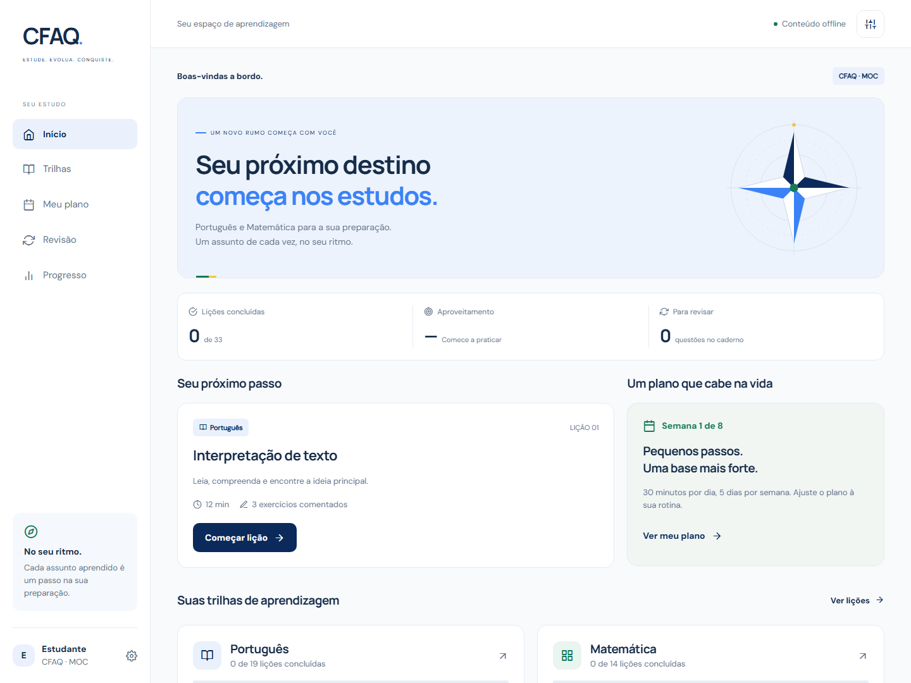

# CFAQ

**Estude. Evolua. Conquiste.**

Um app feito no Brasil para ajudar brasileiros a estudar **Português e Matemática** na preparação para CFAQ, com foco em **Moço de Convés (MOC)** e **Moço de Máquinas (MOM)**.

Idealizado por **Cauã Lima**. Aprendizagem em passos pequenos: entender o assunto, ver um exemplo, responder, compreender a resolução e revisar. Sem vidas, rankings, sequências punitivas ou anúncios.

## O que funciona nesta versão

- **33 lições:** 19 de Português e 14 de Matemática, com explicações e exemplos autorais.
- **99 exercícios comentados:** três por lição, com feedback após cada resposta.
- **Duas trilhas:** todos os assuntos disponíveis, com busca que aceita palavras sem acento.
- **Plano de oito semanas:** sequência baseada nos assuntos da apostila, com duração diária e dias de estudo ajustáveis.
- **Caderno de erros:** questões erradas reaparecem para revisão; um acerto posterior retira a pendência.
- **Treino misto:** 10 ou 20 questões sorteadas, divididas igualmente entre as matérias.
- **Progresso real:** resultados, tentativas, atividade dos últimos sete dias e histórico de sessões.
- **Preferências locais:** nome opcional, MOC/MOM, 15–60 minutos por dia e 3–6 dias por semana.
- **Privacidade:** armazenamento no aparelho, sem conta ou backend. Exclusão com confirmação.
- **Identidade brasileira:** paleta da referência, detalhes em verde e amarelo, ícone próprio e tipografia legível.

As questões inaugurais exercitam os assuntos; não substituem todo o banco de exercícios da apostila. MOC e MOM compartilham o mesmo conteúdo nesta versão. O plano de oito semanas é uma sugestão pedagógica, sem calendário obrigatório nem prazo de prova inventado.

## Rodar no Expo Go

Requisitos: **Node.js 22.13 ou superior**, npm e **Expo Go compatível com SDK 57** no celular. O projeto usa React Native 0.86 e React 19.2, com versões alinhadas ao SDK pelo Expo.

    git clone https://github.com/luilma-dev/cfaq.git
    cd cfaq
    npm ci
    npm start

Conecte computador e celular à mesma rede. Escaneie o QR code exibido no terminal com o Expo Go no Android ou com a câmera no iPhone. Se a rede bloquear a conexão local, tente **npx expo start --tunnel**; o CLI pode solicitar a instalação de seu suporte a túnel.

Se o Expo Go indicar incompatibilidade, consulte [as versões do Expo Go](https://expo.dev/go). Não atualize ou rebaixe apenas React Native isoladamente: confira a [matriz de versões do Expo](https://docs.expo.dev/versions/v57.0.0/).

Para abrir no computador:

    npm run web

As lições, questões e fontes acompanham o bundle. **Durante o estudo, não há chamadas de conteúdo a uma API.** O primeiro carregamento no Expo Go precisa alcançar o servidor; a disponibilidade do projeto em uma reabertura sem rede depende do cache do Expo Go. Um aplicativo instalado para uso independente exigirá uma build de distribuição futura.

## Verificações

    npm run check
    npx expo-doctor
    npm run export

**check** executa TypeScript, ESLint e 18 testes do motor de aprendizagem e da integridade do conteúdo. **export** gera bundles para Android, iOS e web em dist/; não gera APK ou IPA.

Os testes de interface usam contextos isolados, sem tocar no progresso de um navegador pessoal:

    npx playwright install chromium
    npm run test:e2e

Há seis cenários, executados em desktop e viewport de celular: início, lição/revisão/persistência, busca, preferências, treino/saída e links inválidos. Os testes produzem capturas em docs/images. Um viewport de celular não substitui teste físico Android/iOS.

Veja o [registro de validação](docs/VALIDACAO.md) para resultados e limitações, incluindo avisos das dependências.

## Documentação do projeto

| Documento                                      | Conteúdo                                          |
| ---------------------------------------------- | ------------------------------------------------- |
| [Proposta](docs/PROPOSTA.md)                   | Ideia, brasileiros atendidos, princípios e escopo |
| [Plano de estudo](docs/PLANO-DE-ESTUDO.md)     | Oito semanas, método e páginas da apostila        |
| [Identidade visual](docs/IDENTIDADE-VISUAL.md) | Marca, cores, tipografia e acessibilidade         |
| [Arquitetura](docs/ARQUITETURA.md)             | Rotas, conteúdo, estado e persistência            |
| [Roadmap](docs/ROADMAP.md)                     | Melhorias futuras e critérios de aceite           |
| [Validação](docs/VALIDACAO.md)                 | Checks, testes e limites da entrega               |
| [Changelog](CHANGELOG.md)                      | Evolução registrada em versões e commits          |

## Estrutura

    src/
      app/           Rotas do Expo Router
      components/    Interface compartilhada, navegação e identidade
      context/       Carregamento e gravação do progresso
      data/          Currículo, explicações e questões
      lib/           Regras de aprendizagem independentes da interface
    tests/
      learning.test.ts
      e2e/           Cenários de interface em navegador isolado
    docs/            Produto, estudo, decisões técnicas e capturas
    assets/brand/    Símbolo vetorial original

## Referência e autoria

Apostila fornecida pelo idealizador: **CFAQ & CAAQ — Português e Matemática**, **Equipe Palas**, PDF de 200 páginas. A apostila orienta a organização temática; **o PDF não é redistribuído**. As explicações e os 99 enunciados deste app foram escritos para o projeto, com referências temáticas às páginas do material.

Projeto independente, sem vínculo oficial com a Marinha do Brasil. O edital de cada seleção pode ter requisitos diferentes: compare o programa antes de usar o app como única preparação. O projeto não promete aprovação.

Código sob licença MIT. A licença do código não concede direitos sobre a apostila de terceiros. Contribuições de conteúdo devem manter referências e incluir gabarito conferido e resolução.
